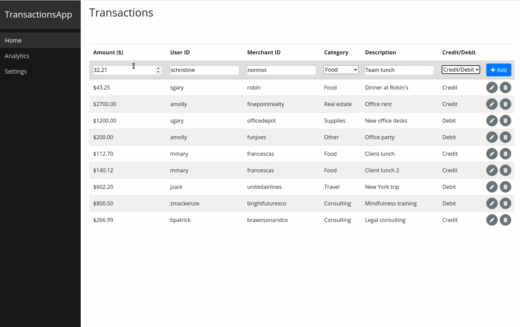
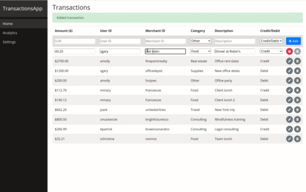
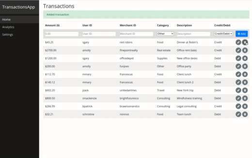
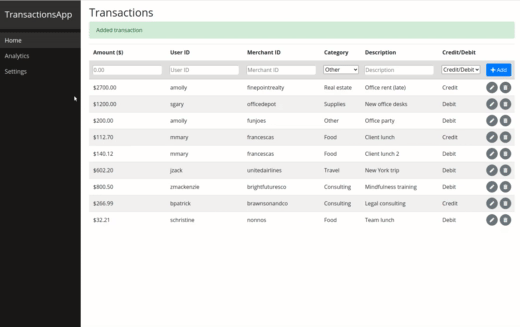
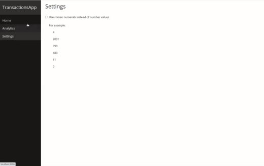

# Divvy Homework Assignment Submission
by Lucia Martisovitsova

Followed the front end assignment instructions and completed 3 objectives, plus some unit tests:
* Write a basic user interface that allows users to enter, edit, and remove transactions.
* Provide a pie chart or histogram of the spend per category.
* Create a user setting that can convert the displayed numbers to Roman Numerals.

User interface:
  
  
  

Pie chart:
  

Roman numerals toggle:
  

For a higher resolution demonstration, check out [this video](https://www.youtube.com/watch?v=Ympch0Y4RwI).

---------------------------------------

# Divvy Homework Assignment

This repository provides a starting point for a basic React + GraphQL application.
All of the configuration boilerplate is complete so you can start by writing the code that you want us to see.

Please **fork** this repo to your GitHub account.

## Project Setup

This repository is split into a web app directory (eg `/webapp`) and two server directories (eg `/webserver` and `/elixir`).

The `/webserver` one includes a functional GraphQL server in NodeJS with MongoDB backing it.

The `/elixir` one includes a functional GraphQL server in Elixir with Postgresql backing it.

Pick one or the other to use.

This project is intentionally not utilizing 3rd party services or create-react-app to give you the opportunity to showcase your talents wherever they are, be it the front end or the back end.

**Node** version **12** is the safest NodeJS release to use.  You can try version 14, but there can be node-gyp/python issues on OSX.

## Instructions

See the [frontend instructions](frontend.md) for frontend focused instructions.

See the [backend instructions](backend.md) for backend focused instructions.

